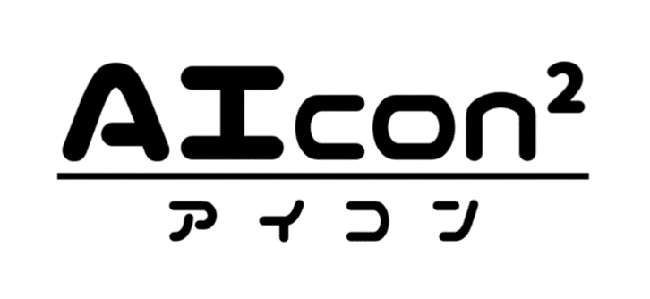
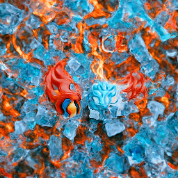

# AIcon 2

[](https://circleci.com/gh/nakajima-john-shotaro/AIcon_dev/tree/main) 
[](https://github.com/nakajima-john-shotaro/AIcon_dev/actions/workflows/misspell-fixer.yml) 
[](https://github.com/nakajima-john-shotaro/AIcon_dev/actions/workflows/docker-ci.yml) 
[](https://github.com/nakajima-john-shotaro/AIcon_dev/actions/workflows/codeql-analysis.yml)


### AIcon is a web application that uses state-of-the-art AI to generate images from input text.
### AIconは最先端のAIを使って、入力された文章からそれに沿った画像を生成するWEBアプリケーションです。

# 
<div align="center" width="80%" height="auto">
    
</div>


# Example
* ### *Burning ice*
<div align="center" width="80%" height="auto">
    
</div>

* ### *New green promenade*
<div align="center" width="80%" height="auto">
    
</div>

* ### *Fire and ice*
<div align="center" width="80%" height="auto">
    
</div>


# Requirements

- Docker (19.03+)
- Nvidia docker (https://github.com/NVIDIA/nvidia-docker)

# System Requirements

## Minimum
- **CPU**: 64-bit Intel or AMD processor (also known as `x86_64`, `x64`, and `AMD64`)
- **Memory**: 8 GB RAM
- **Graphics**: Nvidia GeForce GTX and RTX series from 4 GB RAM or equivalent Nvidia Quadro card


## Recommendation
- **CPU**: 64-bit Intel or AMD processor (also known as `x86_64`, `x64`, and `AMD64`)
- **Memory**: 16 GB RAM
- **Graphics**: Nvidia GeForce RTX series from 8 GB RAM with Tensor Core


# Platform Support

- Ubuntu 18.04/20.04
- WSL2 (Requires `CUDA for WSL Public Preview`. See [here](https://developer.nvidia.com/cuda/wsl))


# Usage

## 1. Clone this repo.

## 2. Pull docker image
```sh
docker pull magicspell/aicon:latest
```

## (Or build docker image yourself)
```sh
cd docker && ./build-docker.sh
```

## 3. Run docker container
```sh
cd docker && ./run-docker.sh
```

## 4. Run the AIcon server
```sh
cd backend && python server.py
```

## 5. Connect to the sever
With the default settings, you can connect to the server by typing `http://localhost:5050` in the address bar of your browser.


# Citations
```bibtex
@misc{unpublished2021clip,
    title  = {CLIP: Connecting Text and Images},
    author = {Alec Radford, Ilya Sutskever, Jong Wook Kim, Gretchen Krueger, Sandhini Agarwal},
    year   = {2021}
}
```

```bibtex
@misc{brock2019large,
    title   = {Large Scale GAN Training for High Fidelity Natural Image Synthesis}, 
    author  = {Andrew Brock and Jeff Donahue and Karen Simonyan},
    year    = {2019},
    eprint  = {1809.11096},
    archivePrefix = {arXiv},
    primaryClass = {cs.LG}
}
```

```bibtex
@misc{sitzmann2020implicit,
    title   = {Implicit Neural Representations with Periodic Activation Functions},
    author  = {Vincent Sitzmann and Julien N. P. Martel and Alexander W. Bergman and David B. Lindell and Gordon Wetzstein},
    year    = {2020},
    eprint  = {2006.09661},
    archivePrefix = {arXiv},
    primaryClass = {cs.CV}
}
```

```bibtex
@misc{ramesh2021zeroshot,
    title   = {Zero-Shot Text-to-Image Generation}, 
    author  = {Aditya Ramesh and Mikhail Pavlov and Gabriel Goh and Scott Gray and Chelsea Voss and Alec Radford and Mark Chen and Ilya Sutskever},
    year    = {2021},
    eprint  = {2102.12092},
    archivePrefix = {arXiv},
    primaryClass = {cs.CV}
}
```


```bibtex
@misc{kitaev2020reformer,
    title   = {Reformer: The Efficient Transformer},
    author  = {Nikita Kitaev and Łukasz Kaiser and Anselm Levskaya},
    year    = {2020},
    eprint  = {2001.04451},
    archivePrefix = {arXiv},
    primaryClass = {cs.LG}
}
```

```bibtex
@misc{esser2021taming,
    title   = {Taming Transformers for High-Resolution Image Synthesis},
    author  = {Patrick Esser and Robin Rombach and Björn Ommer},
    year    = {2021},
    eprint  = {2012.09841},
    archivePrefix = {arXiv},
    primaryClass = {cs.CV}
}
```